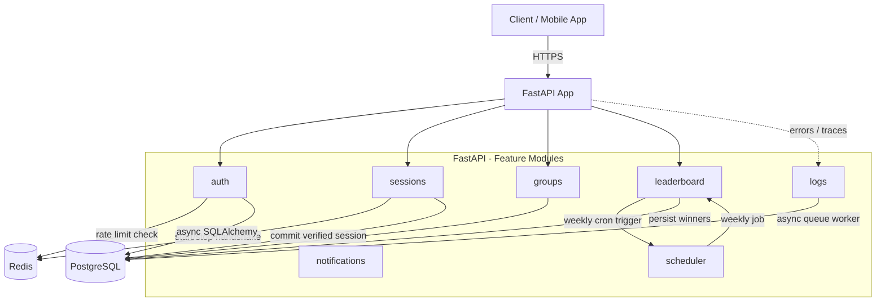

# Unjack Backend

> A FastAPI-based backend powering **Unjack** — a social accountability and app-blocking app for Gen Z. Handles authentication, focus session tracking, group management, and weekly leaderboards, built with an anti-cheat-first architecture.

<p align="left">
  
  
  
  
  
  
  
  
</p>

---

## Why Unjack

Most focus/app-blocking apps rely on self-reported honesty. Unjack adds a **social accountability layer** — group leaderboards, weekly winners, and a Redis-backed start/stop session handshake — so focus time is verified, not just logged.

---

## Features

* **Authentication** — JWT-based auth with registration, login, token refresh, and Argon2 password hashing.
* **Sessions** — Focus sessions logged via a secure start/stop handshake, staged in Redis before being committed, to prevent leaderboard cheating.
* **Groups** — Create, manage, and join groups (max **60 members** per group, enforced business rule).
* **Leaderboard** — Weekly rankings within groups with automated winner calculation.
* **Cron Job** — Scheduled weekly winner calculation and persistence.
* **Database Logging** — Asynchronous, non-blocking queue-based logging engine capturing tracebacks, request IDs, and user IDs to PostgreSQL.
* **Rate Limiting** — Redis-backed sliding window limiter (15 requests / 15 minutes on auth endpoints).

---

## Architecture

Built using a **Modular Clean Router Structure (MCRS)** — each feature domain owns its router, models, schemas, repositories, and services.



**Flow highlights:**
- Sessions are staged in Redis during the start/stop handshake, then committed to Postgres only once verified — this is what prevents leaderboard manipulation.
- The logging engine runs as a background async queue worker (via FastAPI lifespan events) so log writes never block request handling.
- The scheduler spins up at app startup and handles weekly winner calculation as a cron-style background job.

---

## Tech Stack

| Layer              | Technology                          |
|---------------------|--------------------------------------|
| API Framework        | FastAPI                             |
| Language              | Python 3.11+                        |
| Database              | PostgreSQL (async via `asyncpg`)    |
| ORM                    | SQLAlchemy (async)                  |
| Migrations            | Alembic                             |
| Cache / Rate Limiting | Redis                               |
| Auth                    | JWT + Argon2                        |
| Background Jobs      | APScheduler / FastAPI lifespan tasks|
| Containerization    | Docker Compose                      |
| Testing                | Pytest                              |

---

## Setup

1. **Install dependencies**:
   ```bash
   pip install -r requirements.txt
   ```

2. **Set up environment variables**:
   * Copy `.env.example` to `.env`
   * Fill values for your local environment (database URL, secret key, etc.)

3. **Run database migrations**:
   ```bash
   alembic upgrade head
   ```

4. **Start the server**:
   ```bash
   uvicorn app.main:app --reload
   ```

---

## Docker Setup

To spin up the entire application stack (FastAPI backend, PostgreSQL, and Redis) locally with hot-reloading:

```bash
docker compose up --build -d
```

---

## API Documentation

Once running, visit `http://localhost:8000/docs` for the interactive Swagger UI.

<!--
Add a screenshot here once available, e.g.:

-->

**Suggested screenshots to add:**
- Swagger UI (`/docs`) overview
- A sample authenticated request in Postman/curl with response
- Leaderboard endpoint response showing a group's weekly ranking

---

## API & Testing Guides

Additional project documentation lives in [`docs/`](./docs):

* [cURL Testing Guide](./docs/curl_test_guide.md) — raw `curl` queries for every endpoint.
* [API Testing Guide](./docs/api_testing_guide.md) — comprehensive request/response details.
* [Database Logging Guide](./docs/TEST_GUIDE.md) — structural sequencing and request flows.

---

## Testing

Run the automated test suite locally:

```bash
pytest
```

---

## Roadmap

- [ ] Push notifications for group activity
- [ ] Public API rate-limit dashboard
- [ ] Deployment guide (Azure Container Apps)

---

## License

MIT — see [LICENSE](./LICENSE) for details.